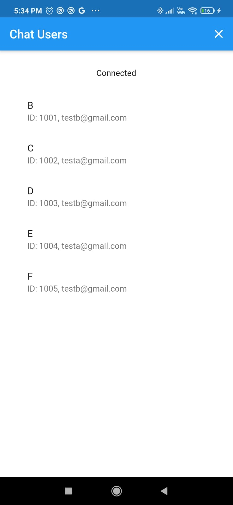
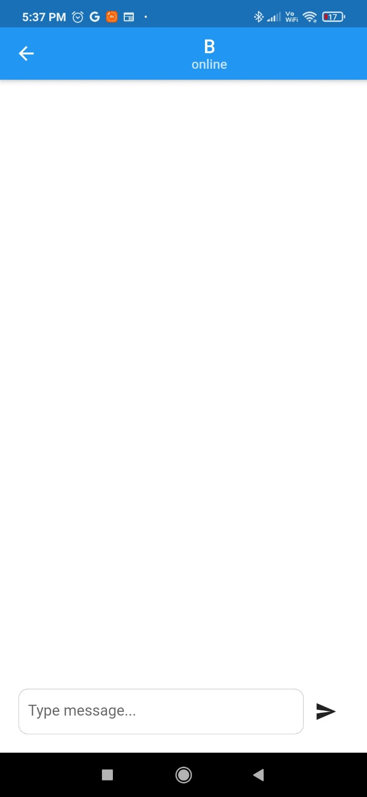
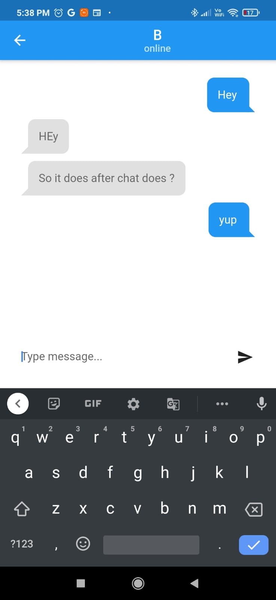
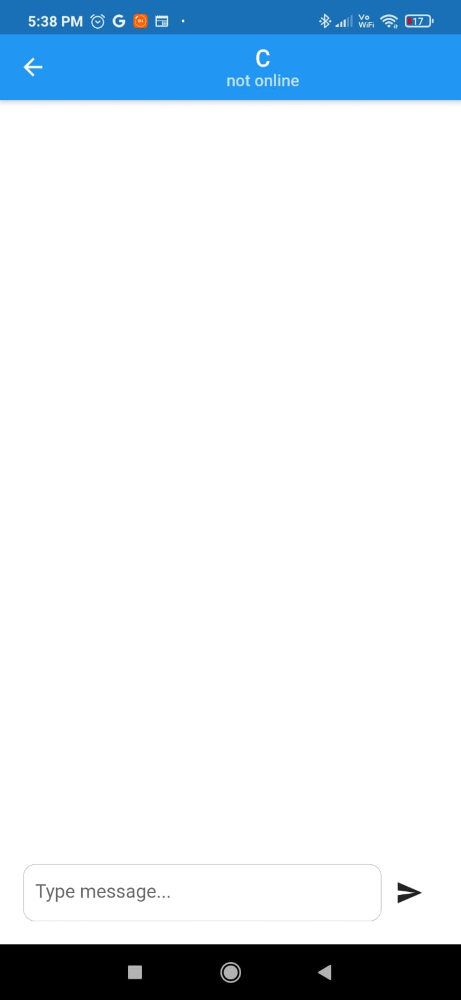
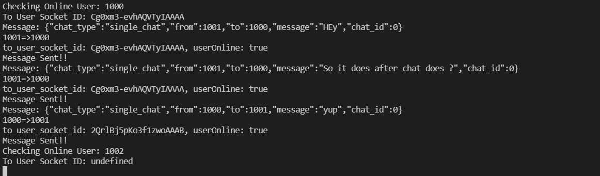

# flutter_demos

SigiNode a application made with Flutter and Node.js (socket.io)

## Getting Started

Contains a not so secure method to have a chat online with a small server based script , currently local host (was at digital ocean but no payment no server they say , rude as aws)

### Screen Shots 

Yes 0% creativity 

### Server Shot 

So secure !

